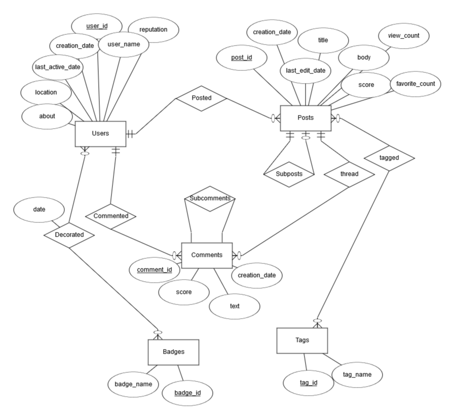

# pg-forum
[](https://opensource.org/licenses/MIT)
[](https://github.com/psf/black)

pg-forum is an application which can be used to build, browse and edit a forum from the command-line using a PostgreSQL database. The application in its current form is modeled to browse a web forum Q&A site such as those found under the stackexchange umbrella, and the repository contains example data drawn from a woodworking stack exchange data dump. A user may leverage both custom and pre-built queries to browse the database. 

# Table of Contents
1. [Requirements](#requirements)
2. [Install & Run](#run)
3. [Usage](#usage)
4. [Commands](#commands)
5. [Data Source](#source)
6. [Application Design](#design)
7. [ER Diagram & Relational Schema](#schema)
8. [License](#license)

# Requirements <a name="requirements"></a>

python 3.7+: https://www.python.org/downloads/  
pipenv: https://pipenv.readthedocs.io/en/latest/install/#installing-pipenv  
PostgreSQL: https://www.postgresql.org/

# Install & Run <a name="run"></a>

Undervoid is developed to utilize pipenv, which takes care of dependencies for you. To install pipenv, run:  
`pip3 install --user pipenv`. 

Once you've cloned the repository and installed pipenv, you can install dependencies with:  
`pipenv install`

Make a copy of ”database.ini.template” and rename the copy to ”database.ini”. Update the file with the proper credentials to connect to your PostgreSQL  server. Sections are marked by [sectionname]. The default section is postgres. Multiple sections can be created to allow connections with different accounts, or to different databases.

Example database.ini:
```
[postgres]
host=localhost
port=5432
user=postgres
password=12345
database=postgres
schema=CLforum
```

Depending on platform and environment settings, you may run python3 on your system with one or more of the following keywords:
`python` or `python3`

From the root directory, type `pipenv run [python_keyword] app\dbbuilder.py` to build out the database.  

From the root directory, type `pipenv run [python_keyword] app\main.py` to run the app.  

Note: Running either `main.py` or `dbbuilder.py` from within the `app` subdirectory will raise an error.  

## Usage <a name="usage"></a>

### dbbuilder.py

`pipenv run python app\dbbuilder.py [-d] <database> <destroy> <all> <table1 table2 table3...>`

1.  If `destroy` is included as a command-line argument, the schema specified in database.ini will be dropped with all its tables.
2.  If `-d` is included as an argument, the argument following will be interpreted as the section of the database.ini to use for the connection.  If this is not specified, it will default to `postgres`.
3.  Otherwise, specific desired tables can be supplied for building. Options are: `badges, commented, comments,decorated, posted, posts, subcomments, subposts, tagged, tags, thread, users`.
4.  If no command-line  arguments  are  supplied, dbbuilder.py will build all tables. This is the recommended option. Thus, the full database can be build simply with the following command: `pipenv run app\dbbuilder.py`

### main.py

`pipenv run python app\main.py <database>`

main.py takes a single optional command-line argument. If supplied, this argument will be interpreted as the section of database.ini to use for the connection. If this is not specified, it will default to `postgres`.

## Commands <a name="commands"></a>

`exit`  
Used at any time to exit the program and disconnect from the database.

`query tool`  
`sqlrunner`  
Entering one of these aliases activates a mode for entering sql queries directly from the command line. The user can type back to return to the application command line.

`explore users`  
Returns lists of users in groups of ten. The user can press `<ENTER>` to see more results, or type `back` to return to the application command line.
  
`explore posts`  
Returns lists of posts in groups of ten. The user can press `<ENTER>` to see more results, or type `back` to return to the application command line.
  
`explore tags`  
Returns lists of tags in groups of ten. The user can press `<ENTER>` to see more results, or type `back` to return to the application command line.

`view user <user_id>`  
Allows the user a detailed view of the profile for the selected user_id, including user badges.

`view post <post_id>`  
Allows the user a detailed view of the post, subposts, and comments for the selected post_id.

`view tag <tag_id>`  
Returns a list of the posts affiliated with a selected tag_id.

`new post`  
Allows the user to create a new post. This demonstrates a stored procedure. __Known bug__: if the user enters a tag name not in the database, the application will throw an error and exit.

`new post <post_id>`
Allows the user to create a subpost on post_id. Uses many of the same queries as new post, but also inserts the post into Subposts.

`new comment <post_id>`  
Allows the user to create a comment on post_id.

`delete post <post_id>`  
Allows the user to delete a post with post_id.

`delete comment <comment_id>`  
Allows the user to delete a comment with comment_id.

## Data Source <a name="source"></a>

Stack Exchange performs periodic data dumps of their databases related to each of their sites.  Each data dump is made up of a number of XML files formatted for use with databases; `Badges, Comments, Post History, Post Links, Posts, Tags, Users, Votes`.  I chose to use an abridged woodworking.stackexchange.com datadump as an example, and XML files are included in the github repository under `\app\data`. As part of my project, I created a sub-app `dbbuilder.py` which parses these XML files and builds them into a PostgreSQL Database. `dbbuilder.py` can be run against any stackexchange data dump to build a PostgreSQL database from the contents.

Stack exchange data dumps can be found here: https://archive.org/details/stackexchange

## Application Design <a name="design"></a>

This application utilizes the `psycopg2` driver to connect to a PostgreSQL server.  The entire application is written in Python with embedded SQL queries. The application was tested with a Postgres server running on localhost, and with a PostgreSQL server running on a Google Cloud VM. This is a command-line based application; there is a SQL query tool for entering queries directly,  as well as menu options which call a number of prebuilt queries. 

Key files: 

`main.py`  
Utilized to run the application. Checks for command line arguments and instantiates connector and browser objects.

`connector.py`  
Contains python class Connector. Objects of this class can be used to connect to a postgres database and perform queries.

`browser.py`  
Contains python class Browser. This class does the heavy lifting for parsing user input and sending queries to the connector.

`dbbuilder.py`  
Contains python class Dbbuilder. This class parses the XML files and builds out the database according to the design seen in the ER Diagram and Relational Schema sections of this README. dbbuilder.py can beused with command line arguments to drop the schema and all its tables, or build out only a selection oftables.

`database.ini`  
This  config  file  holds  all  credentials  needed  to  connect  to  a  Postgres  database.   Multiple  sections  can  beplaced in the file to allow for different user accounts and/or databases/schemas to be used.

## ER Diagram & Relational Schema <a name="schema"></a>

### Diagram



### Schema

Users(__user_id__, user_name, location, reputation, creation_date, last_active_date, about)  
Posts(__postid__, creation_date, last_edit_date, favorite_count, view_count, score, title, body)  
Posted(__user_id,post_id__)  
user_id IS A FOREIGN KEY TO Users  
post_id IS A FOREIGN KEY TO Posts  
Tags(__tag_id__, tag_name)  
Tagged(__post_id,tag_id__)  
post_id IS A FOREIGN KEY TO Posts  
tag_id IS A FOREIGN KEY TO Tags  
Comments(__comment_id__, text, score, creation_date)  
Commented(__user_id,comment_id__)  
user_id IS A FOREIGN KEY TO Users  
comment_id IS A FOREIGN KEY TO Comments  
Thread(__post_id, comment_id__)  
post_id IS A FOREIGN KEY TO Posts  
comment_id IS A FOREIGN KEY TO Comments  
Badges(__badge_id__, badge_name)  
Decorated(__user_id,badge_id__, date)  
user_id IS A FOREIGN KEY TO Users  
badge_id IS A FOREIGN KEY TO Badges  
Subposts(__parent_id,child_id__)  
parent_id and child_id ARE FOREIGN KEYS to Posts.post_id  
Subcomments(__parent_id,child_id__)  
parent_id and child_id ARE FOREIGN KEYS to Comments.comment_id  

## License <a name="license"></a>
  
This program is licensed under the "MIT License".  Please
see the file `LICENSE` in the source distribution of this
software for license terms.

### Misc

Title Art generated at https://fontmeme.com/pixel-fonts/
